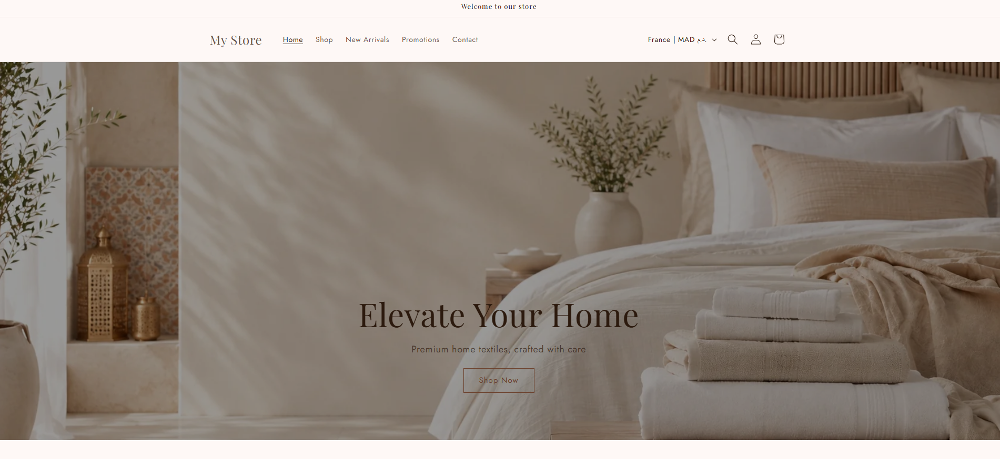
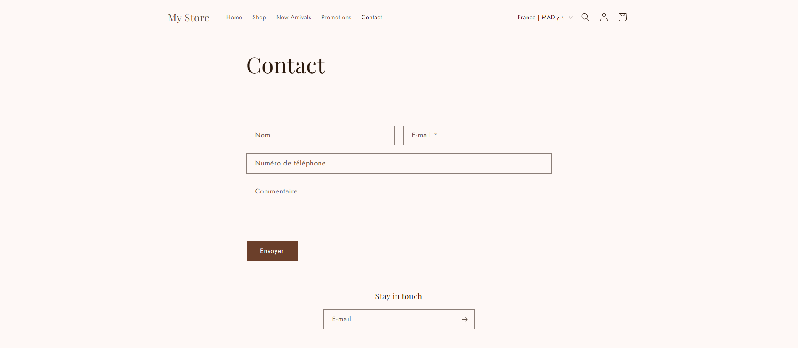

# Shopify E-commerce Store

Boutique e-commerce créée et personnalisée avec Shopify et le thème Dawn.

## Aperçu

### Page d'accueil

### Page de contact

## Présentation du projet

Ce projet présente la création et la personnalisation d'une boutique e-commerce Shopify orientée linge de maison et textile premium.

La boutique a été configurée avec une identité visuelle beige et marron, une navigation simple et une présentation adaptée à une image de marque élégante et moderne.

## Fonctionnalités mises en place

- Personnalisation du thème Dawn
- Création et organisation de la page d'accueil
- Mise en place du menu principal
- Création des collections et de la navigation
- Configuration de la page de contact
- Configuration des moyens de paiement
- Paramétrage de la livraison
- Livraison gratuite à partir d'un montant défini
- Configuration des politiques de retour et d'expédition
- Personnalisation des e-mails Shopify
- Configuration SEO de base
- Préparation de l'intégration Google Analytics
- Adaptation de l'affichage pour mobile
- Import et organisation des produits et variantes

## Technologies et outils

- Shopify
- Thème Dawn
- Liquid
- HTML
- CSS
- JavaScript
- Shopify Admin

## Objectif

L'objectif du projet est de proposer une boutique en ligne claire, élégante et facile à utiliser, tout en préparant les principaux éléments nécessaires à la vente en ligne : navigation, produits, collections, paiements, livraison et communication client.

## Captures

Les captures disponibles dans `docs/screenshots/` présentent la page d'accueil et la page de contact de la boutique en mode visiteur.

## Auteur

Ghassan James
